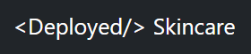
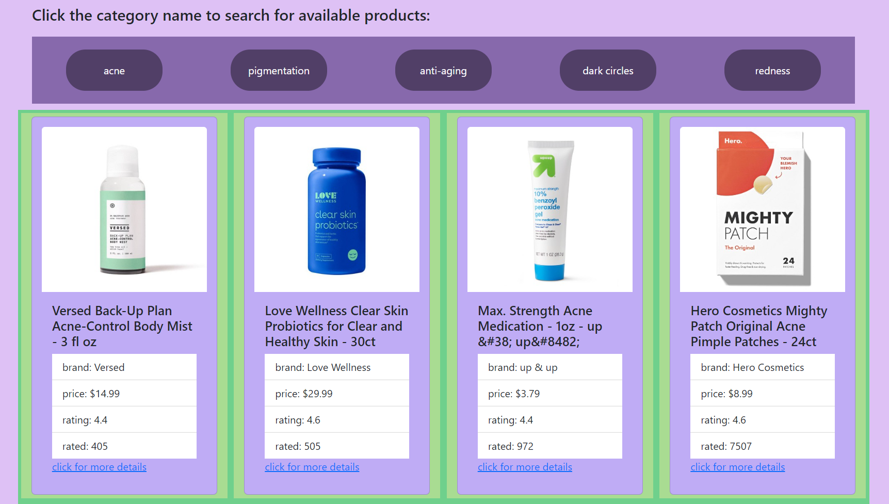

 

### Welcome to <Deployed /> Skincare - web app created by three female developers passionate about coding AND skincare. 

 <strong><em> Deployed Skincare - is a MERN stack application built with implementing the best technologies tested by time and other professionals. In this application we combined MERN stack with GraphQL API and React on front end to deliver the most up-to-date standards in modern we development. Our team is striving to provide our users with the most accessible and responsive functionality, as well as the fastest and safest usage. Our goal is to make both skincare and code that works more accessible to everyone </em></strong>

 

> ### ___For a better navigation experience please refer to the following links:___  
- [Application Architecture](#application-architecture)
- [Functionality & Motivation ](#functionality-and-motivation)
- [Meet the creators](#meet-the-creators)
- [Screenshots & Links](#screenshots-and-links)
  

### ___Application Architecture___

 To match the standards for the MERN stack application we designed Deployed Skincare in accordance with <strong>MVC (Model-View-Controller)</strong> architectural pattern.  
Our <strong>Model</strong> tier is hosting MongoDB, where we store seed data for our application and our Models. 
The client tier <strong>View</strong> is written with Javascript, CSS, JSX (React). This level of architecture lets the user interact with the front-end features of our application.  
The <strong>Controller</strong> tier responsible for the logic is written using Node.js, Express.js. The database is accessed through GraphQL API and authentication is provided by JWT.  
Unlike other applications we built in the past where we could divide the responsibilities within the MVC pattern, our development process needed to be approached by layering content and functionality synchronously. MERN stack applications definitely require a specific approach and it helped us a lot to test client and server together once we were able to render. 

Please refer to the following resources in this repository 
[Client-side](./client/) --- [Components](./client/src/components/) --- [Root Component](./client/src/App.js)  
[Server-side](./server/) --- [Models](./server/models/) --- [Queries & Mutations](./server/schemas/)  

   ### ___Functionality and Motivation___
> #### Functionality
- The users are presented with a homepage with a short introduction about our application. <strong>Navigation bar</strong> offers to take a user to different pages (which are rendered React components), <strong>Login/Signup</strong> page offers an option to create a user account to access more advanced feature of the application in the future. Thanks to GraphQL and JWT authentication features, we provided a safe way for saving user's credentials. 

- <strong>Search Product</strong> page lets users click on a category name and retrieve the products that belong to a selected category. 

- Right now the functionality stretches as far as to let users 'favorite' the products and in the future we'll be working on enabling the users to see all the 'favorite' products on a separate page (rendered on a separate React Component).  
> #### Motivation
Ultimately, our goal is create a space where every user can find a product that will serve specifically their needs, and if the users are not sure what that product is, our application will provide online consultations to cater to users' needs.  As those who have tested dozens of products, we're also aiming to let our users to select the most affordable prices with certified vendors. And most importantly, make users feel like there's someone out there with the same concerns ready to support them!   

   ### ___Meet the creators___
<dl>
    <dt><strong>⭐ Caitlin O'Reilly <strong></dt>
    <dd>Caitlin is a third grade teacher and a full stack developer with a passion for creating educational technology resources for her students and other children. She loves traveling, watercolor painting, and trying new craft breweries. </dd>
</dl>

<dl>
    <dt><strong>⭐ Valeriya Kim </strong></dt>
    <dd>Val loves videogames, collects mechanical keyboards and dreams to move to Orlando Harry Potter World. Full Stack MERN & Java geek with a passion for server-side/back-end web development.</dd>
</dl>

<dl>
    <dt><strong>⭐ Ariel Miller  </strong></dt>
    <dd>A full stack web developer with a strong proficiency in HTML, CSS, JS, MERN stack, Sequelize, MySQL, NoSQL, Mongoose, Bootstrap, and MaterializeCSS.</dd>
</dl>

| 👩‍💻 Developer  | 💻 GitHub                                      | 💬 LinkedIn/Portfolio                    |
|:--------------:|:----------------------------------------------:|:-----------------------------------------:|
| Caitlin       | [caitoreilly](https://github.com/caitoreilly)   | [Caitlin O'Reilly](https://caitoreilly.github.io/react-portfolio/)
| Valeriya      | [valkim55](https://github.com/valkim55)         | [Valeriya Kim](https://www.linkedin.com/in/valeriya-kim-763572204/)
| Ariel         | [amiller0806](https://github.com/amiller0806)   | [Ariel Miller](https://amiller0806.github.io/HTML-Advanced-CSS-Portfolio/)

### ___Screenshots and Links___
> #### Screenshots

Before you navigate to our app checkout a few screenshots below: 

<strong> home: </strong> 
 
<strong> select product: </strong> 
 
  

> #### Links
<strong> You can find deployed versions of our application on Heroku <em>[here:](heroku link) </em> and on GitHub Pages <em>[right here:](github pages link)</em> </strong>
  

### Thank you for visiting!💖
